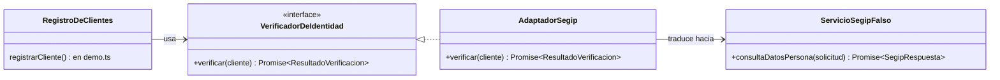

# H3 · con-adapter — Adapter

**Copia de [`../base/`](../base/) con Adapter y nada más.** `modelo.ts` no cambió.

## El problema en la base

`registrarCliente()` acepta el CI que el cliente dice de palabra. El taller necesita verificarlo contra el
**SEGIP** antes de recibir un equipo, pero el SEGIP habla otro idioma, y SIGOT no puede cambiarlo:

| Dato | Idioma de SIGOT (`Cliente`) | Idioma del SEGIP |
|---|---|---|
| Número de documento | `numeroDocumento: string` | `nroDocumento: number` |
| Complemento | `complemento: '1a'` (como lo tipea recepción) | `complemento: '1A'` |
| Lugar de expedición | `expedido: 'LP'` | `codDepartamento: 2` |
| Nombre | `nombreCompleto: 'Juan Carlos Pérez Mamani'` | `nombres` + `primerApellido` + `segundoApellido`, en mayúsculas y sin tildes |
| Resultado | lo que M3 necesita decidir | `codigoRespuesta: 1 \| 2` |
| Servicio caído | un resultado más | una excepción de red (`ECONNREFUSED`) |

Si `registrarCliente()` hablara SEGIP directamente, M3 quedaría atado a un sistema externo: cambiar de proveedor,
probar sin conexión o soportar otro país obligaría a abrir la recepción.

## Los roles del patrón en SIGOT

| Rol GoF | Clase | Archivo |
|---|---|---|
| **Target** | `VerificadorDeIdentidad`, el contrato en idioma SIGOT | `verificador-de-identidad.ts` |
| **Adapter** | `AdaptadorSegip`, que firma el contrato y traduce ida y vuelta | `adaptador-segip.ts` |
| **Adaptee** | `ServicioSegipFalso`, la API externa simulada | `segip.ts` |
| **Client** | `registrarCliente()` | `demo.ts` |

Es un **adaptador de objetos** (composición: recibe el servicio por constructor), no de clases (herencia): el SEGIP
es un sistema remoto, no una clase de la que se pueda heredar.



## Qué cambió respecto de la base

| Archivo | Cambio |
|---|---|
| `modelo.ts` | **ninguno** |
| `verificador-de-identidad.ts` | **nuevo**: el contrato y `ResultadoVerificacion` |
| `segip.ts` | **nuevo**: el servicio externo simulado, con `simularCaida()` |
| `adaptador-segip.ts` | **nuevo**: la única clase que conoce los dos idiomas |
| `demo.ts` | `registrarCliente()` recibe un `VerificadorDeIdentidad` y decide según el resultado. `registrarOrden()` y el ciclo de vida son los de la base |

## Decisiones que defiendo

1. **La excepción de red no cruza la frontera.** El adaptador la traduce a `SERVICIO_NO_DISPONIBLE`. El contrato promete (LSP) que ninguna implementación lanza excepciones.
2. **SEGIP caído no frena el mostrador.** El cliente se registra como *pendiente* y la duda queda visible. Detener la recepción del taller por un servicio externo iría contra la **fiabilidad** (H1 §5.2) justo en el lado equivocado.
3. **Nombre oficial al verificar.** Si coincide, el `Cliente` se registra con el nombre del padrón, no con lo que tipeó recepción.
4. **Solo `demo.ts` sabe que es el SEGIP.** En Angular sería `{ provide: VERIFICADOR_DE_IDENTIDAD, useClass: AdaptadorSegip }`, y en las pruebas otro proveedor.

## Lo que muestra la salida

Los cuatro casos de la verificación: **verificado** con tildes y minúsculas, **nombre que no coincide**, **CI inexistente** y **SEGIP caído**.
Después, la orden de Juan nace con su nombre oficial y su ciclo de vida es idéntico al de la base: la orden no se enteró del SEGIP.

## Origen

Reutiliza la práctica de clase `adapter/verificador-identidad-segip.ts`, adaptada a la base: el contrato ahora recibe
el `Cliente` de `modelo.ts` en vez de un `DocumentoIdentidad` suelto, y la práctica se separó en un archivo por rol.

## Correr

```bash
node demo.ts
```

Salida real: [`salida.txt`](salida.txt).
