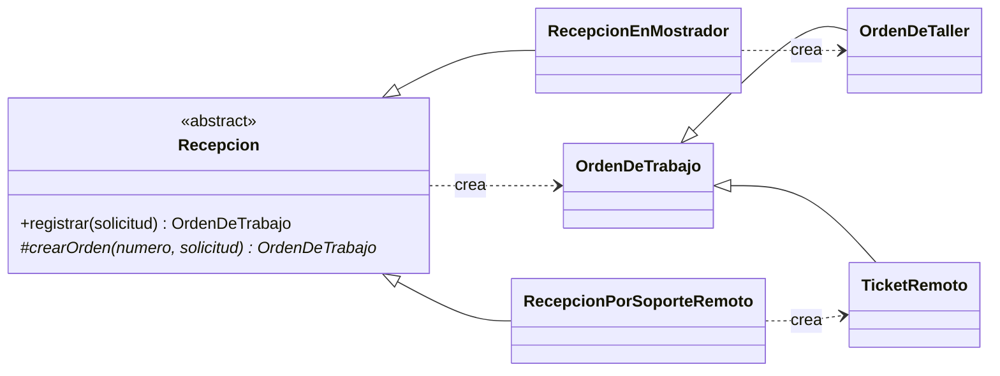

# H3 · con-factory — Factory Method

**Copia de [`../base/`](../base/) con Factory Method y nada más.** `modelo.ts` no cambió.

## El problema en la base

El taller recibe órdenes por dos canales: el **mostrador** (equipo físico, plazo en días) y el
**soporte remoto** (ticket sin equipo, plazo en horas). En la base, `registrarOrden()` decide con un
`switch (tipo)` qué orden nace, y cada `case` repite el `new OrdenDeTrabajo(...)` con sus propias reglas:

```ts
switch (tipo) {
  case 'TALLER': return anunciar(new OrdenDeTrabajo(`OT-${numero}`, cliente, equipo, ..., sumarDias(...)));
  case 'REMOTO': return anunciar(new OrdenDeTrabajo(`TK-${numero}`, cliente, null,   ..., sumarHoras(...)));
}
```

Mañana entra un tercer canal (WhatsApp o un formulario web público) y hay que **abrir esa función**
y volver a probar los dos canales que ya funcionaban.

## Los roles del patrón en SIGOT

| Rol GoF | Clase | Archivo |
|---|---|---|
| **Creator** | `Recepcion` (abstracta): `registrar()` es el procedimiento fijo, `crearOrden()` es el factory method | `recepcion.ts` |
| **ConcreteCreator** | `RecepcionEnMostrador`, `RecepcionPorSoporteRemoto` | `recepcion.ts` |
| **Product** | `OrdenDeTrabajo` | `modelo.ts` (sin cambios) |
| **ConcreteProduct** | `OrdenDeTaller`, `TicketRemoto` | `ordenes.ts` |



## Qué cambió respecto de la base

| Archivo | Cambio |
|---|---|
| `modelo.ts` | **ninguno** |
| `ordenes.ts` | **nuevo**: los dos productos concretos. Cada uno fija su prefijo (`OT-`/`TK-`) y su plazo. `OrdenDeTaller` exige un `Equipo` por tipo, ya no un `Equipo \| null` |
| `recepcion.ts` | **nuevo**: el creador abstracto y los dos creadores concretos |
| `demo.ts` | desaparecen `registrarOrden()`, `anunciar()` y el `switch`. La recepción es un solo `recepcion.registrar(solicitud)` para cualquier canal |

## Lo que muestra la salida

- `[TIPO] OT-0001 nació como OrdenDeTaller; TK-0002 nació como TicketRemoto`: el mismo bucle, sin preguntar el tipo, produjo dos clases distintas.
- Las fechas prometidas son las mismas que en la base (17/09 09:00 y 14/09 13:00): la regla de negocio no cambió, cambió **dónde vive**.
- El ciclo de vida de `OT-0001` es idéntico línea por línea al de la base: el producto concreto sigue siendo una `OrdenDeTrabajo` (LSP).

## Por qué Factory Method y no otra cosa

- **No una "fábrica simple"** con un `crear(tipo)` estático: eso solo muda el `switch` a otra clase. Con Factory Method,
  un canal nuevo es **una subclase nueva** y `Recepcion.registrar()` no se abre (OCP).
- **No Builder:** acá el problema no es *cómo* se arma una orden (eso está en [`../con-builder/`](../con-builder/)),
  es *cuál* orden nace según quién la recibe.

## El costo, dicho en voz alta

- Dos jerarquías paralelas (creadores y productos): con solo dos canales es bastante estructura. Se justifica
  porque el canal de ingreso es justamente lo que el taller va a sumar.
- La validación "en mostrador el equipo es obligatorio" es una excepción en tiempo de ejecución, porque
  `Solicitud` es común a todos los canales. Dentro de `OrdenDeTaller` el compilador sí la hace cumplir.

## Correr

```bash
node demo.ts
```

Salida real: [`salida.txt`](salida.txt).
