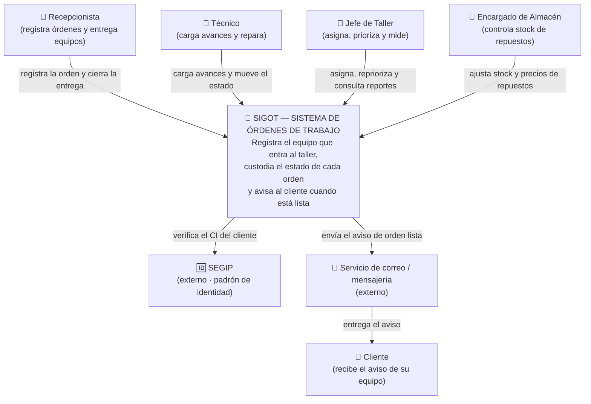
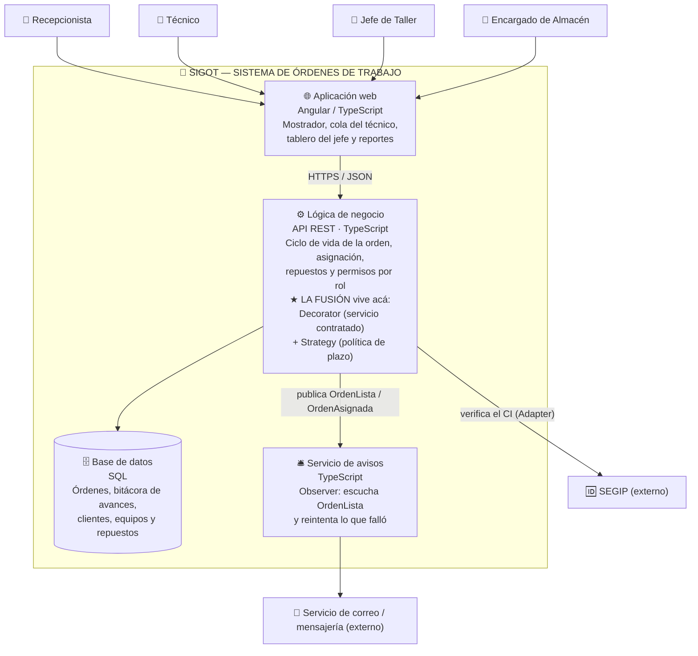

# H4 · Parte B — Arquitectura de SIGOT en C4


Los dos niveles de C4 del sistema, en Mermaid, viviendo en el repositorio. La Parte A (el laboratorio
de patrones y la fusión) está en [`h3/`](../h3/).

---

## Nivel 1 — Contexto (el sistema y su mundo)

La pregunta que responde: **¿quién usa SIGOT y con qué otros sistemas habla?**



**Regla de oro del nivel 1:** si aparece una base de datos o un módulo interno, te pasaste de zoom.

Dos decisiones de este diagrama que no son obvias:

- **El Cliente no apunta a SIGOT.** Es el único actor sin usuario en el sistema ([01-actores.md](../docs/01-actores.md)):
  no opera nada, solo recibe el resultado. Por eso la flecha le llega desde el correo y no al revés.
  Es también la razón de que la **fiabilidad** sea el atributo crítico: el cliente cruza la ciudad
  porque el sistema dijo "lista".
- **El SEGIP está afuera y es un actor de pleno derecho.** Es un tercero que puede fallar, cambiar de
  contrato o de formato. Esa frontera es exactamente donde vive el **Adapter** de [`h3/con-adapter/`](../h3/con-adapter/).

---

## Nivel 2 — Contenedores (el zoom adentro de SIGOT)

La pregunta que responde: **¿de qué piezas ejecutables/almacenes está hecho SIGOT?**



**Regla de oro del nivel 2:** cada caja debe poder "arrancarse" o "consultarse" por separado.
Las clases individuales NO van acá (eso sería nivel 3-4, y el curso no lo exige).

### Dónde viven los dos patrones fusionados

Los dos viven **dentro del contenedor de Lógica de negocio**, y ese es el punto: la fusión no cruza
ninguna frontera de despliegue. Es una decisión de diseño interno, no de arquitectura distribuida.

| Patrón | Qué resuelve dentro de la caja | Código |
|---|---|---|
| **Decorator** | arma el servicio contratado apilando extras y produce el trabajo estimado | [`h3/final/`](../h3/final/) · `Servicio`, `DecoradorDeServicio` |
| **Strategy** | convierte ese trabajo en fecha prometida según el contrato del cliente | [`h3/final/`](../h3/final/) · `PoliticaDePlazo` |

La costura entre los dos es una sola línea, y también vive ahí:

```ts
const prometida = politica.calcular(LUNES_9AM, prioridad, servicio.horas());
```

Por eso la caja de Lógica de negocio es la única que cambia cuando el taller vende un extra nuevo o
firma un contrato nuevo: ni la SPA, ni la base de datos, ni el servicio de avisos se enteran.

### Por qué el corte quedó así

**Los siete módulos M0…M6 de [02-modulos.md](../docs/02-modulos.md) no son contenedores.** M1 y M2 no
arrancan por separado: viven en el mismo proceso y cambian juntos en el mismo despliegue. Dibujarlos
como cajas de nivel 2 sería confundir módulo con contenedor. El mapeo real es:

| Contenedor | Módulos que viven adentro |
|---|---|
| 🌐 Aplicación web | las pantallas de `ordenes`, `asignacion`, `clientes`, `repuestos`, `reportes` |
| ⚙️ Lógica de negocio | M0 · Acceso y Roles · M1 · Órdenes · M2 · Asignación · M3 · Clientes y Equipos · M4 · Repuestos · M6 · Reportes |
| 🗄️ Base de datos | — (persistencia de todos) |
| 🛎️ Servicio de avisos | **M5 · Notificaciones**, en exclusiva |

**M5 es el único módulo que sí merece contenedor propio**, y esa es la decisión de diseño de este
diagrama: reintenta envíos con su propio ritmo contra un tercero que se cae, y **no puede bloquear una
transición de estado**. Si el proveedor de correo tarda 30 segundos en responder, el técnico no puede
quedarse esperando para marcar la orden como `LISTA`. Separarlo es lo que permite que el aviso falle
sin que falle el dominio — que es justo el atributo de calidad que RF5 tensiona.

> **Supuesto declarado:** el H1 y el H2 nunca fijaron el stack del servidor (solo que el cliente es
> Angular). Acá asumo una API REST en TypeScript por continuidad con el laboratorio de `h3/`, que
> está escrito en TypeScript. Si el stack cambia, cambia el texto de dos cajas y nada más del diagrama.

---

## Cómo se conecta con todo lo que ya hice

- Los **actores del nivel 1** son literalmente los de [01-actores.md](../docs/01-actores.md), y sus permisos distintos son RF4.
- El **Servicio de avisos** del nivel 2 es el Observer de [`h3/con-observer/`](../h3/con-observer/) con dirección postal:
  ahí `OrdenObservable` publica y `AvisoAlCliente` escucha; acá se ve dónde corre eso.
- El **SEGIP** del nivel 1 es la frontera donde vive el Adapter de [`h3/con-adapter/`](../h3/con-adapter/).
- La caja **Lógica de negocio** es donde viven los patrones de la Parte A, incluida la fusión de
  [`h3/final/`](../h3/final/): el Decorator arma el servicio contratado y la Strategy convierte sus
  horas en la fecha prometida. La decisión está documentada en [ADR-001](ADR-001-fusion-decorator-strategy.md).
- El diagrama **vive en el repo**: cambia el sistema → cambia el diagrama → queda en el commit.
  Eso es "diagrama como código": documentación que no se desactualiza en un cajón.

---

## Decisiones de arquitectura (ADR)

| ADR | Decisión | Estado |
|---|---|---|
| [ADR-001](ADR-001-fusion-decorator-strategy.md) | Fusionar Decorator y Strategy en el cálculo de la fecha prometida | Aceptada |
