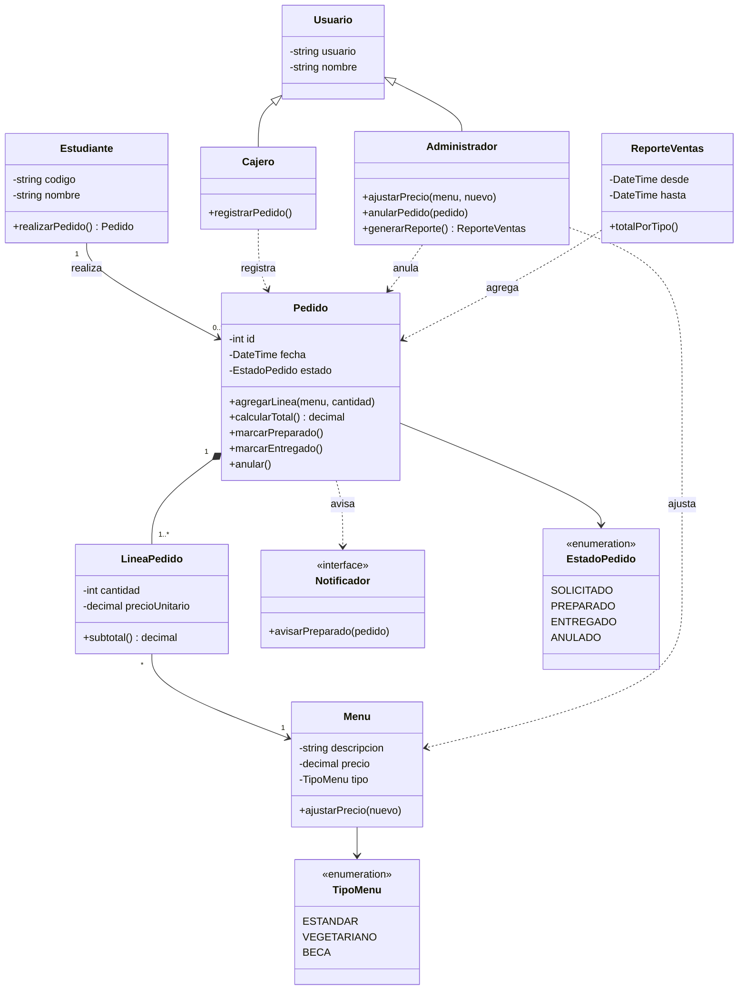

# Diagrama de Clases — Sistema de Comedor Universitario
**Autor: Roberto Angel Ayala Lecoña**

### 1. Sustantivos
Estudiante, Pedido, LíneaDePedido, Menú, TipoDeMenú, EstadoDePedido, Usuario,
Cajero, Administrador, Precio, Aviso/Notificación, ReporteVentas

### 2. Verbos
registrar pedido, agregar menú al pedido, calcular total, cambiar de estado,
marcar preparado, marcar entregado, anular, ajustar precio, avisar al estudiante,
generar reporte de menús vendidos por tipo

### 3. Filtro

| Candidato | Decisión | Motivo |
|---|---|---|
| `TipoDeMenu` | **enum** | Valor cerrado (estándar, vegetariano, beca) |
| `EstadoPedido` | **enum** | Los estados no tienen atributos; las transiciones viven en `Pedido` |
| `Precio` | **atributo** de `Menu` | Es un dato, no un objeto con identidad. |
| `Cajero` / `Administrador` | **subclases** de `Usuario` | Comparten identidad y logins |
| `LineaPedido` | **clase** | Un pedido lleva varios menús con cantidad: necesita cantidad y subtotal propios |
| `Notificador` | **interfaz** | El aviso es comportamiento variable (SMS, pantalla), no un dato |
| `ReporteVentas` | **clase** | Tiene lógica de agregación por tipo y un período |
| `Aviso` | descartado | Ya lo cubre `Notificador`; sería una clase anémica|

### 4. Relaciones
- `Estudiante` **1 → 0..\*** `Pedido` (asociación: un estudiante realiza varios pedidos).
- `Pedido` **1 → 1..\*** `LineaPedido` (composición: la línea no existe sin el pedido).
- `LineaPedido` **\* → 1** `Menu` (asociación: la línea referencia un menú del catálogo).
- `Menu` **\* → 1** `TipoMenu` (enum).
- `Pedido` **1 → 1** `EstadoPedido` (enum).
- `Cajero` y `Administrador` **heredan** de `Usuario` (generalización).
- `Cajero` **→** `Pedido` (dependencia: lo registra).
- `Administrador` **→** `Menu` y `Pedido` (dependencia: ajusta precio y anula).
- `Pedido` **→** `Notificador` (dependencia: al quedar preparado, avisa).
- `ReporteVentas` **→** `Pedido` (dependencia: agrega los pedidos del período).

---

## Diagrama

